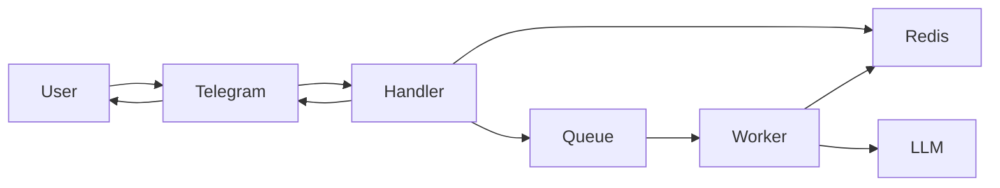

<p align="center">
    <a href="https://t.me/virsona_bot">
        
    </a>
</p>

# Virsona

A virtual persona that can be your AI friend. Chat, share thoughts, get emotional support, practice social skills, develop a relationship, participate in the persona's life, and more. The persona behaves differently depending on the emotional context, current relationship, conversation history, and so on.

Out of the box, multiple personas are available. Each has a different personality and behavior. Choose the one you want to chat with. Switch in the middle of a session if needed, or completely restart the chat.

More than that, you can create a new unique character with any personality, style, behavior, appearance, history, and so forth - anything you can imagine. The persona can act not only as a friend, but also as a partner, relative, colleague, rival, and more. Just describe what you want.

## Demo

Try Virsona in the Telegram bot - [@virsona_bot](https://t.me/virsona_bot). Simply send a hello to start chatting. Note that there is a daily usage limit and response moderation.

[Deploy](#deployment) the project yourself and use it without limitations. It can be done at no cost and will still work perfectly for daily personal use.

## Features

- **Multiple personas**: Chat with different characters, each with their own personality, style and behavior.
- **Custom persona**: Create your own character with any personality, background and role.
- **Context-aware conversation**: Responses take previous messages and ongoing chat context into account.
- **Long-term memory**: Useful facts and conversation summaries are preserved to make interaction feel more continuous over time.
- **Adaptive relationship dynamics**: Attitude and closeness change based on how the conversation develops.
- **Emotional awareness**: The current emotional tone is analyzed continuously, and replies are adjusted to better match the situation.
- **Proactive messaging**: Persona can write first, follow up on past topics and keep the conversation alive naturally.
- **External context**: External data, like current weather, is used to enrich the dialogue.
- **Flexible model support**: Works with multiple LLM providers, including OpenAI, Google and Ollama.
- **Easy self-hosting**: Intended for simple personal deployment and running on your own computer.

## Deployment

1. Clone the repository:

    ```text
    git clone https://github.com/srgykuz/virsona.git
    cd virsona
    ```

2. Create `config.yml` and set the necessary [app configuration](#app). To get started, you need `telegram_token` and at least one of the supported LLM providers (OpenAI, Google, etc).

3. Edit the [system configuration](#system). In `system/config.yml`, set the provider and model you choose.

4. Optionally edit the [Docker configuration](#docker). Changing `APP_PORT` may be needed if you are using the Telegram webhook.

5. Optionally edit the [persona configuration](#persona). Here you can add new personas. The defaults are fine to start with.

6. Start the app:

    ```text
    docker compose up -d --build
    ```

7. Check the logs:

    ```text
    docker compose logs --tail 500
    ```

8. Write `/help` to your Telegram bot to check that it is alive. Then write `Hello` to check that persona is configured correctly.

### Restart

You can edit the system prompt and persona prompts without restarting the app. Edits in other files, such as config files, require restarting the app.

Restart the app:

```text
docker compose down
docker compose up -d --build
```

### Backup

To back up the data, make a copy of the `redis_data` directory.

### Webhook

To enable the Telegram webhook, set `telegram_webhook_enable` and `telegram_webhook_secret_token`. Point your web server to the app server, which is exposed on port `8000` by default or on the port specified by `APP_PORT` env. Point the webhook URL to your web server URL plus the `/webhook` endpoint.

Set the webhook using:

```text
python3 -m src.cli set-webhook <url> <telegram_webhook_secret_token>
```

Check the webhook:

```text
python3 -m src.cli get-webhook
```

Delete webhook:

```text
python3 -m src.cli delete-webhook
```

## Configuration

### App

Application settings. They can be set in the `config.yml` file, the `.env` file, or both.

<details>
<summary>Overview</summary>

| Name | Description | Default |
| --- | --- | --- |
| `telegram_token` | Telegram bot token from BotFather. | `""` |
| `telegram_origin` | Telegram Bot API address where requests are sent. | `https://api.telegram.org` |
| `telegram_webhook_enable` | Receive bot updates using webhook endpoint call instead of long polling. | `false` |
| `telegram_webhook_secret_token` | Secret token used to authenticate webhook requests originating from Telegram. | `""` |
| `google_api_key` | Google API key. | `""` |
| `openai_api_key` | OpenAI API key. | `""` |
| `ollama_api_key` | Ollama API key. | `""` |
| `ollama_host` | Ollama host URL (e.g. `http://localhost:11434` or `https://ollama.com`). | `""` |
| `weather_api_key` | `https://www.weatherapi.com` API key. | `""` |
| `weather_cache_ttl` | Time in seconds to cache fetched weather info. | `900` |
| `system_path` | Path to the directory that stores system prompt and models configs. | `./system` |
| `personas_path` | Path to the directory that stores persona definitions. | `./personas` |
| `redis_url` | Redis connection URL. | `redis://redis:6379` |
| `default_persona` | ID of persona to set after an initial message. If empty, then a random one is selected. | `""` |
| `history_limit` | Maximum number of recent messages to keep in chat history per user. | `50` |
| `facts_limit` | Maximum number of recent facts to keep in chat history per user. | `50` |
| `summaries_limit` | Maximum number of recent summaries to keep in chat history per user. | `25` |
| `chat_flush_interval` | Time in seconds to wait for additional user messages before flushing the buffered batch. | `5` |
| `chat_flush_threshold` | If length of the user messages buffer equals to or exceedes this value, then the buffered batch is flushed immediately. | `10` |
| `input_max_length` | Maximum length of input text from a user. | `5000` |
| `output_separator` | Separator string to split LLM response into multiple messages. | `[SPLIT]` |
| `check_prompt_injection` | Enables or disables a primitive check of prompt injection attack. | `false` |
| `check_illegal_assistant` | Enables or disables a check if assistant response contain illegal content. | `false` |
| `limit_chat_rpm` | Maximum number of requests to LLM per chat allowed per minute. | `0` |
| `limit_chat_rpd` | Maximum number of requests to LLM per chat allowed per day. | `0` |
| `limit_chat_tpm` | Maximum number of LLM tokens usage (input + output) per chat allowed per minute. | `0` |
| `limit_chat_tpd` | Maximum number of LLM tokens usage (input + output) per chat allowed per day. | `0` |
| `code_url` | Link to the source code that will be displayed in the help message. | `""` |

</details>

### Docker

Settings related to deployment. Should be set in `.env` file.

<details>
<summary>Overview</summary>

| Name | Description | Default |
| --- | --- | --- |
| `APP_PORT` | Port on which the application server is exposed. | `8000` |
| `WORKER_REPLICAS` | Number of background workers to run. | `3` |

</details>

### System

[system](system) contains the defaults. You can make changes there directly, or write new files in the [system.d](system.d) directory. To use `system.d`, add `system_path: ./system.d` to the app config.

#### modules

`system/config.yml` contains the configuration of LLM models for the various app modules, so that each module uses a specific LLM model and parameters tuned for its use case.

All modules should be configured. Specify settings for each module individually. See the default [config.yml](system/config.yml) for an example.

<details>
<summary>Modules</summary>

| Name | Description |
| --- | --- |
| `chat` | Used for output generation to user input. |
| `analytics` | Used for chat analysis. |
| `proactivity` | Used for proactive behavior. |

</details>

<details>
<summary>Settings</summary>

| Name | Description | Type | Required |
| --- | --- | --- | --- |
| `provider` | SDK to use. | `openai`, `google`, `ollama` | yes |
| `model` | Model name to use. | `str` | yes |
| `params` | Model parameters that are passed in SDK call. | `dict` | no |
| `limits` | Limits module usage across all calls. | `dict` | no |
| `limits.rpd` | Requests per day limit. | `int` | no |
| `limits.tpd` | Tokens (input + output) per day limit. | `int` | no |

</details>

#### prompt

`system/prompt.md` contains general instructions for every persona. It specifies the common role, style, behavior, and so on that each persona should follow. The persona prompt is embedded into this prompt. After rendering, the result is used as the system prompt in the LLM API call.

It is a Jinja template that receives specific variables during rendering. You can use these variables however you want. See the default [prompt.md](system/prompt.md) for an example.

<details>
<summary>Variables</summary>

For type fields see [schema.py](src/schema.py).

| Name | Description | Type |
| --- | --- | --- |
| `settings` | Application configuration. | `dict` |
| `user` | User profile. | `User` |
| `user_facts` | Facts remembered about the user from past conversations. | `Facts \| None` |
| `user_emotional_state` | Latest inferred emotional state of the user. | `EmotionalState \| None` |
| `persona` | Selected persona configuration. | `Persona` |
| `persona_datetime` | Current date and time in the persona's timezone. | `datetime` |
| `persona_now` | Formatted current date and time in the persona's timezone. | `str` |
| `persona_weekday` | Current weekday index in the persona's timezone (`0` = Monday). | `int` |
| `persona_weather` | Current weather for the persona's city. | `WeatherInfo \| None` |
| `persona_prompt` | Rendered persona prompt. | `str` |
| `conversation_summary` | Summaries of earlier conversation history. | `ConversationSummary \| None` |
| `relationships` | Current relationship state between the user and persona. | `Relationships \| None` |
| `tools` | Mapping of available tool names to tool descriptions. | `dict \| None` |

</details>

### Persona

[personas](personas) contains the defaults. You can make changes there directly, or write new files in the [personas.d](personas.d) directory. To use `personas.d`, add `personas_path: ./personas.d` to the app config.

#### config

`personas/<id>/config.yml` contains persona settings. All fields are required. See the default [config.yml](personas/emily/config.yml) for an example.

<details>
<summary>Overview</summary>

| Name | Description | Type |
| --- | --- | --- |
| `id` | Unique persona identifier used as internal ID. | `str` |
| `timezone` | IANA timezone used for persona-local time calculations. | `str` |
| `city` | Persona's city used for city-related context. | `str` |
| `language` | Persona's language code. Used for localization, not for response language. | `str` |
| `sleep_from` | Hour when the persona starts sleeping. | `int`, [0, 23] |
| `sleep_to` | Hour when the persona stops sleeping. | `int`, [0, 23] |
| `typing_speed` | Typing speed in characters per second. | `int`, [0, 50] |
| `proactivity_factor` | Base tendency of the persona to initiate proactive messages. | `float`, [0.0, 1.0] |
| `proactivity_friendship` | Minimum friendship score required before proactive behavior is allowed. | `int`, [-100, 100] |
| `block_friendship` | Minimum friendship score after which persona stops responding to the user. | `int`, [-100, 100] |

</details>

#### prompt

`personas/<id>/prompt.md` contains instructions unique to each persona. This is where you define the specific personality. Later, this prompt is embedded into the system prompt.

It is a Jinja template. See the default [prompt.md](personas/emily/prompt.md) for an example. See the system prompt [documentation](#system) for the available variables.

## Architecture

### Components

The application consists of several core components:
- **Telegram**: UI for input and output.
- **Handler**: Handles messages, runs logic, composes system prompt, manages chat flow, queues background tasks.
- **Queue and workers**: Run background tasks, such as response generation, analysis and proactive messaging.
- **Redis**: Stores user profile, session info, chat data and queue-related state.
- **LLM**: Union interface for LLM API of any provider (OpenAI, Google, etc). API is used for replies, analytics and proactivity.



### Request flow

1. The user sends a message on Telegram.
2. Telegram delivers the update to the app.
3. The app builds the system prompt and sends it to the LLM API together with the chat history.
4. The LLM API responds with a generated reply, and it is sent back to the user on Telegram.
5. Background jobs update long-term memory, analyze the conversation and schedule proactive messages.

### Prompt composition

A final prompt is composed from these main parts:
- **System prompt**: Defines the general behavior, style and rules for every persona.
- **Persona prompt**: Defines a specific character: personality, style, behavior, role, etc.
- **Context data**: Adds conversation history, long-term memory, relationship state, emotional state and optional external data such as weather.

All of this is then merged together into the final prompt that is sent to the LLM API as the system prompt.
